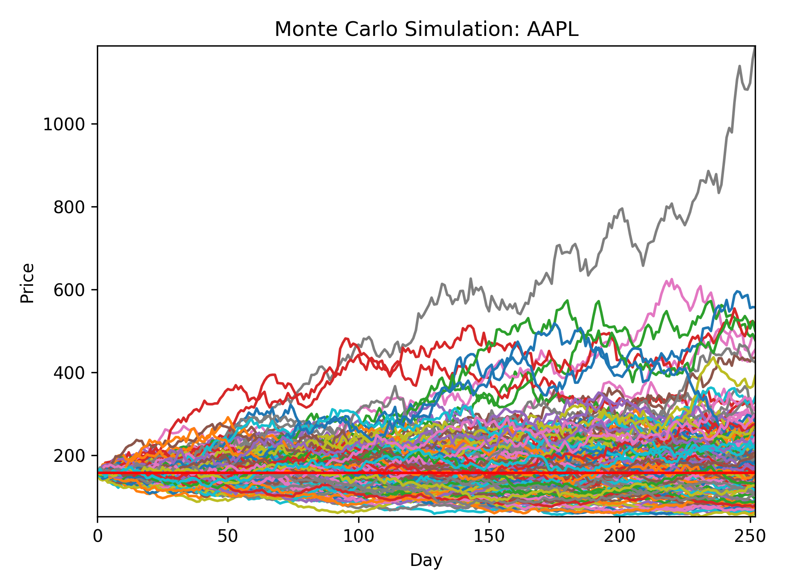

# Basic Monte Carlo Simulation

This project allows the user to run Monte Carlo simulations on any ticker covered by Yahoo.

"static_example_AAPL.py" runs a Monte Carlo simulation on the "AAPL.csv" return data within this repository and is ment as a proof of concept.

"dynamic_sim.py" allows the user to run a Monte Carlo simulations and gives him the freedom to make the following choices:

<ul>
<li>Ticker</li>
<li>Sample size in years</li>
<li>Number of individual simulations</li>
<li>Data export</li>
<li>Run another query</li>
</ul>

All simulations are run for the following trading year, i.e. 252 days.

<em><strong>Disclaimer: </strong>This was a short side project of mine, the interface is not very user friendly, e.g. you will get ValueErrors if you enter false values. Entering false tickers will also not yield results or lead to wrong results.</em>
